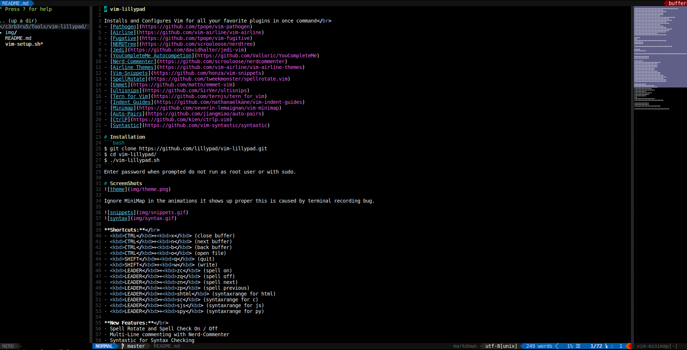

# vim-lillypad

Installs and Configures Vim for all your favorite plugins in one command</br>
- [Pathogen](https://github.com/tpope/vim-pathogen)
- [Airline](https://github.com/vim-airline/vim-airline)
- [Fugative](https://github.com/tpope/vim-fugitive)
- [NERDTree](https://github.com/scrooloose/nerdtree)
- [Jedi](https://github.com/davidhalter/jedi-vim)
- [YouCompleteMe Autocompetion](https://github.com/Valloric/YouCompleteMe)
- [Nerd-Commenter](https://github.com/scrooloose/nerdcommenter)
- [Airline Themes](https://github.com/vim-airline/vim-airline-themes)
- [Vim-Snippets](https://github.com/honza/vim-snippets)
- [SpellRotate](https://github.com/tweekmonster/spellrotate.vim)
- [Emmet](https://github.com/mattn/emmet-vim)
- [ultisnips](https://github.com/SirVer/ultisnips)
- [Tern for Vim](https://github.com/ternjs/tern_for_vim)
- [Indent Guides](https://github.com/nathanaelkane/vim-indent-guides)
- [Minimap](https://github.com/severin-lemaignan/vim-minimap)
- [Auto-Pairs](https://github.com/jiangmiao/auto-pairs)
- [CtrlP](https://github.com/kien/ctrlp.vim)
- [Syntastic](https://github.com/vim-syntastic/syntastic)
- [jslint](https://github.com/douglascrockford/JSLint)
- [jsonlint](https://github.com/zaach/jsonlint)

# Installation
```bash
$ git clone https://github.com/lillypad/vim-lillypad.git
$ cd vim-lillypad/
$ ./vim-lillypad.sh
```
Enter password when prompted do not run as root user or with sudo.

# ScreenShots


Ignore MiniMap in the animations it shows up proper this is caused by terminal recording bug.


**Shortcuts:**</br>
- <kbd>CTRL</kbd>+<kbd>x</kbd> (close buffer)
- <kbd>CTRL</kbd>+<kbd>n</kbd> (next buffer)
- <kbd>CTRL</kbd>+<kbd>b</kbd> (back buffer)
- <kbd>CTRL</kbd>+<kbd>o</kbd> (open file)
- <kbd>SHIFT</kbd>+<kbd>q</kbd> (quit)
- <kbd>SHIFT</kbd>+<kbd>w</kbd> (write)
- <kbd>LEADER</kbd>+<kbd>zc</kbd> (spell on)
- <kbd>LEADER</kbd>+<kbd>zq</kbd> (spell off)
- <kbd>LEADER</kbd>+<kbd>zn</kbd> (spell next)
- <kbd>LEADER</kbd>+<kbd>zp</kbd> (spell previous)
- <kbd>LEADER</kbd>+<kbd>shtml</kbd> (syntaxrange for html)
- <kbd>LEADER</kbd>+<kbd>sc</kbd> (syntaxrange for c)
- <kbd>LEADER</kbd>+<kbd>sjs</kbd> (syntaxrange for js)
- <kbd>LEADER</kbd>+<kbd>spy</kbd> (syntaxrange for py)

**New Features:**</br>
- Spell Rotate and Spell Check On / Off
- Multi-Line commenting with Nerd-Commenter
- Syntastic for Syntax Checking of HTML, JSON, Python and more
- Snippets with YouCompleteMe Support
- Loads of Color Themes
- CtrlP for Searching Recent Files
- Emmet for web-development
- Line indent guides
- Minimap
- SyntaxRange for multi-language files
- Added support for Javascript autocomplete using Tern

**Features to Come:**</br>
- Update Script for Plugins
- Vim IDE Script and tmux with powerline support

One quick install and config script and your up and running.
